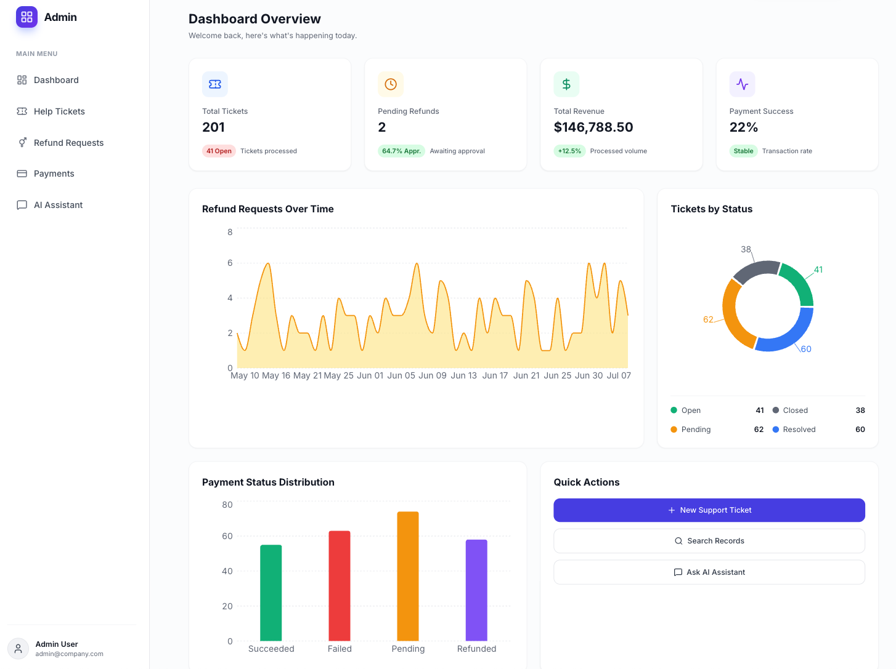
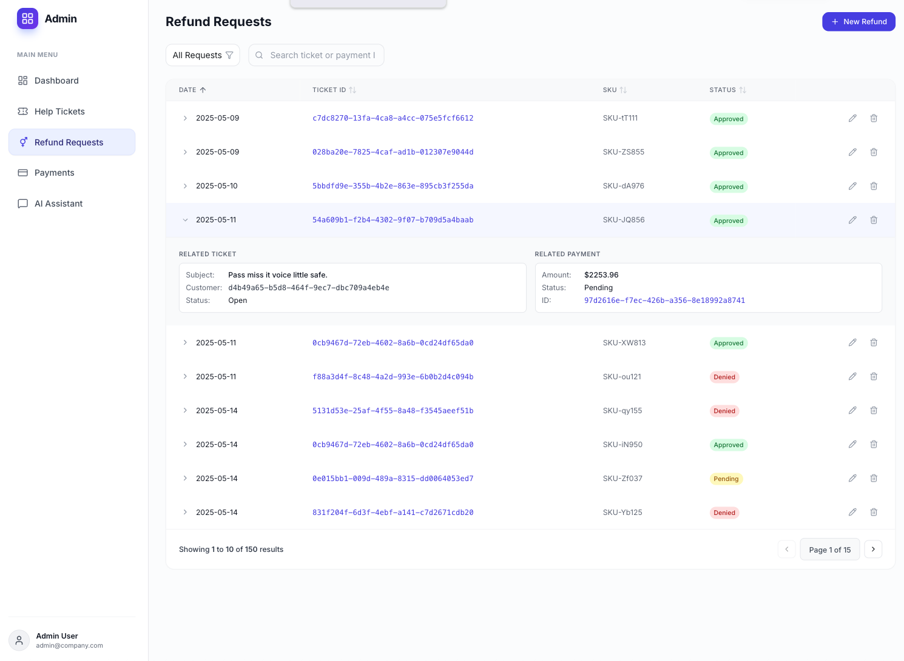
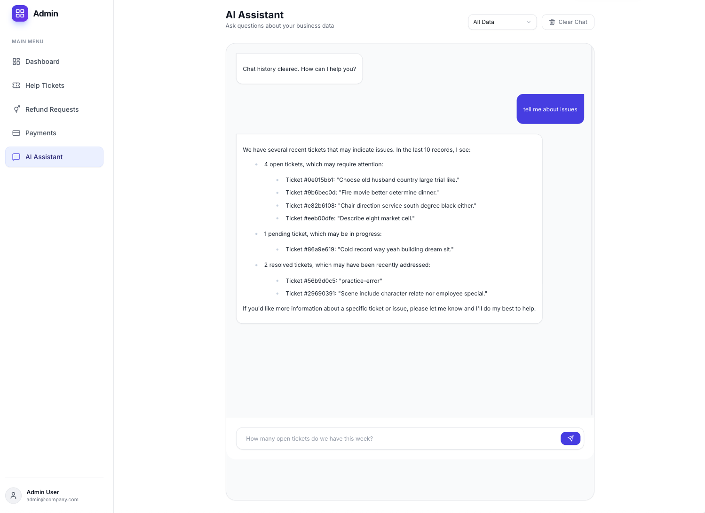

# Conversational Agent App

### Main Dashboard

### Refunds Page

### Chat LLM Interface

This repository demonstrates how to build custom Databricks Apps applications integrating Databricks' Lakebase (OLTP database) 
and querying Foundation Model LLM APIs on Databricks, allowing users to securely add, edit and delete and run LLM queries on records stored in Databricks.

## Configuration

Variables that need to be set in `app.yaml`:

1. Reflex Access Token
- Visit [Reflex Cloud Tokens](https://cloud.reflex.dev/tokens/)
- Navigate to Account Settings → Tokens
- Create a new token and copy the value
- Replace `<your-token-here>` in the configuration

2. Databricks Resources
- Update `DATABRICKS_WAREHOUSE_ID` with your SQL warehouse ID
- Update `DATABRICKS_CATALOG` with your target catalog name
- Update `DATABRICKS_SCHEMA` with your target schema name